# Eyongtarh Tennis Club

[Link to Eyongtarh Tennis Club](https://eyongtarh.github.io/Eyongtarh-Tennis-Club/)

Eyongtarh Tennis Club is a club designed to help train children and adult lawn tennis skills from beginners to professional levels. The club also takes into consideration the fitness training of the trainees.

## Features

### Header

The header includes the name : Eyongtarh Tennis Club as logo. This logo has a link to the home page. The header also includes a navigation bar. The navigation bar accommodates the links to the three pages: Home, Services, and book time. The second part of the header incledes a welcome message for visitors or members to enjoy the club's resort and services.The last part is an anchor: "Read More" and this in linked to the service page, and in the service page, its linked to the book time page, and in the book time page, its linked to the service page. The Home page header can be seen below:

<a>
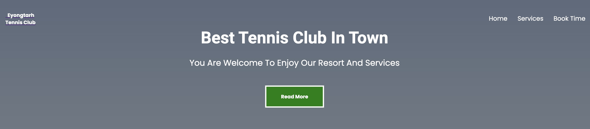
</a>

### Home 

Here, a note explaining the types of tennis courts available is displayed in three different columns.
It also highlights the nature of the courts and placement in relation to the surfaces which are clay court,
hard court and grass court. 
These three columns are displayed one at a time with a javascript code as shown below:

<a>
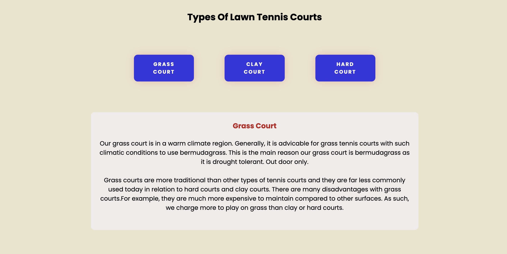
</a>

The second part of home page is made of pictures of the three different courts. The names of the courts hover the pictures on moust over. The picture below demonstrates the mouse over of the first picture.

<a>
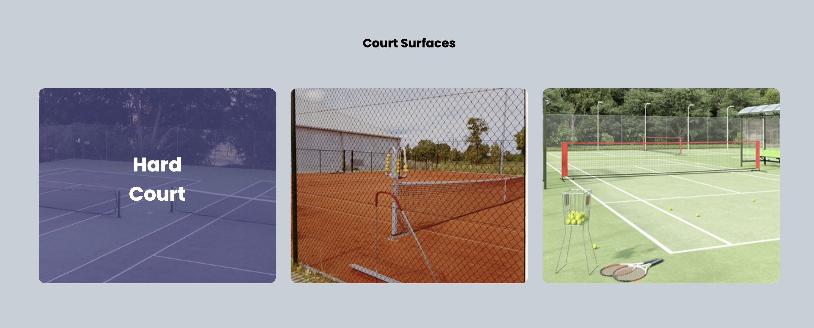
</a>

### Services

The services page is the second page. It indicates that the club is providing training to children, 
recreational players, and competitive players. Basically, the services are for children and adults. The three different training models are well explaine in this section. These three models are presented in three columns with one being displace at a time with javascript code as presented below:

<a>
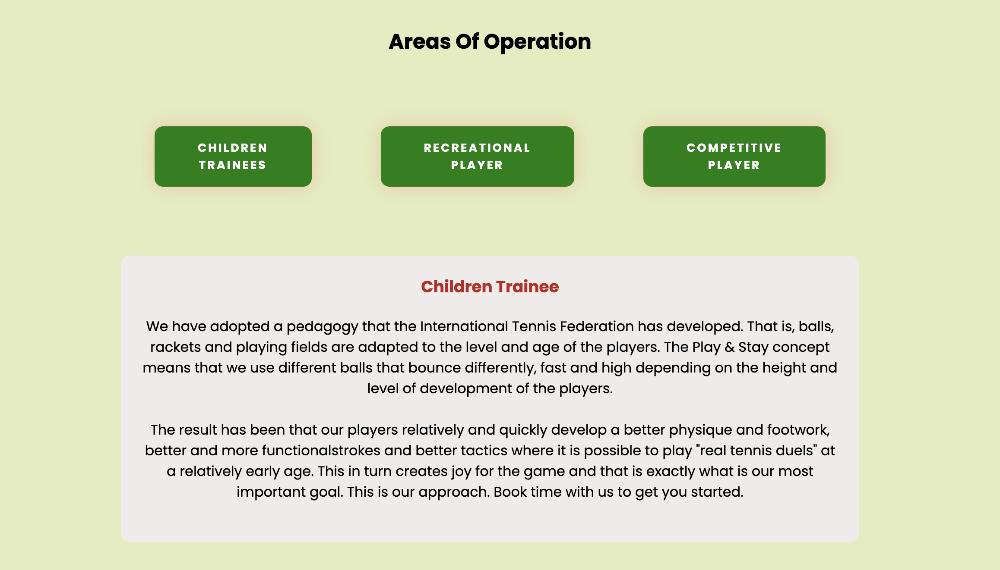
</a>

The second part of this page provides pictures of the different trainees. A text message of the trainee type hover each picture on mouse over. In same light, the picture below illustrates the mouse over effect on the first picture.

<a>
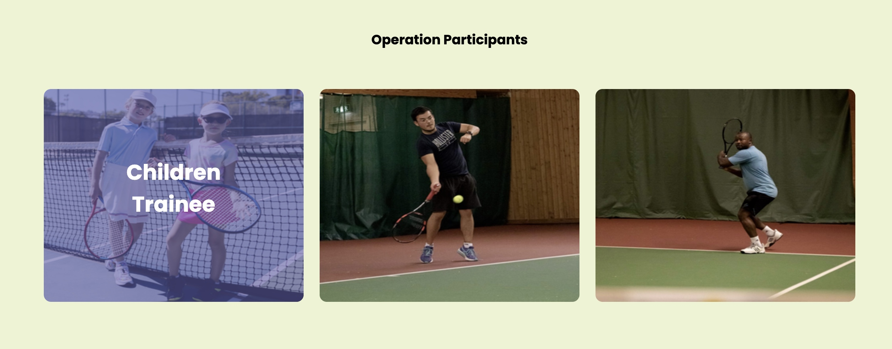
</a>

### Bookin Time

This is the third and final page. The first column in section one contains a map location for Gothenburg town and a video example of tennis exercise drill. The second column provides a form which registers the customer and book time with a trainer. The following picture demonstrates this:

<a>
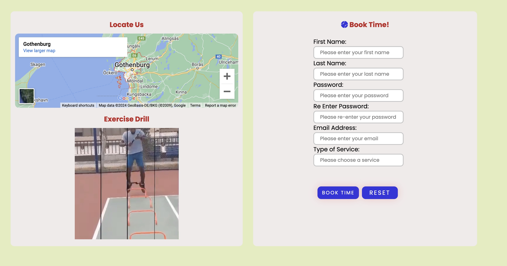
</a>

The second section is made up of pictures of other facilities in the club: play ground, swimming pool, and a gym/fitness. The names equally hover the pictures. The hover effect can be seen on the second photo as viz:

<a>
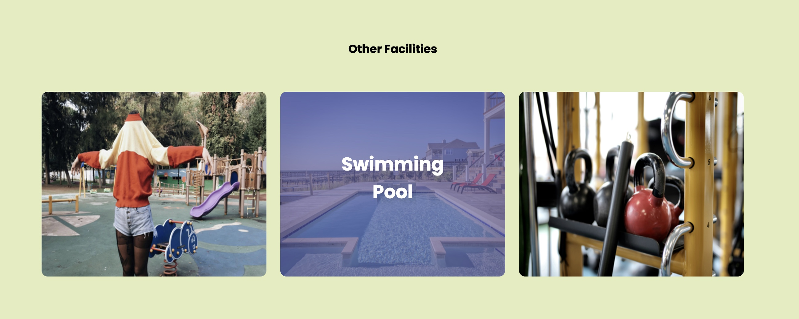
</a>

### Contact information
The address, email address and telephone number of the club is include in the footer section at the bottom of each page.

### The footer

The footer contains three different features in three columns. The first column is made up of links to social media websites which opens in a new page: Twitter, YouTube, Instagram, Facebook, and a copyrights statement. The second and third sections contains the contact information and opening hours respectively. This is presented below:

<a>
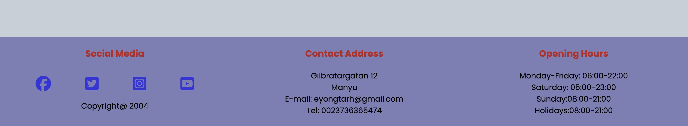
</a>

## Testing

### Within Page

The links included in the page works perfectly.The book time form also shows a positive respond to use. Form validation is prevented if appropriate informatiion is not given. This is demonstrated as thus:

<a>
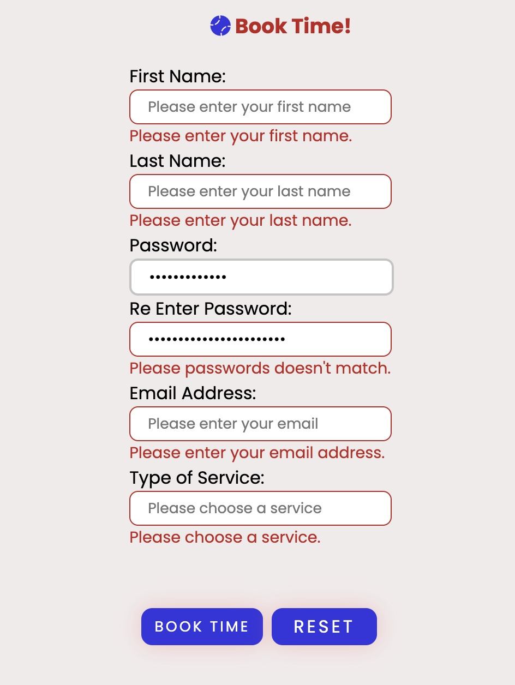
</a>

### Lighthouse

The accessibility rating for page one in lighthouse is OK. The lighthouse test for the home page is shown below :

<a>
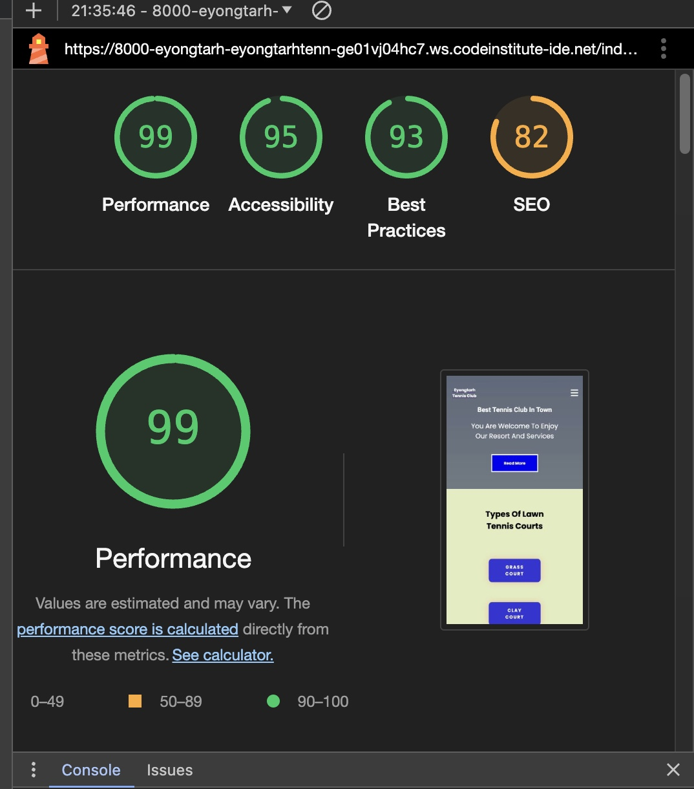
</a>

The accessibility rating for page 2 in lighthouse is OK. The lighthouse test for the service page is shown below :

<a>
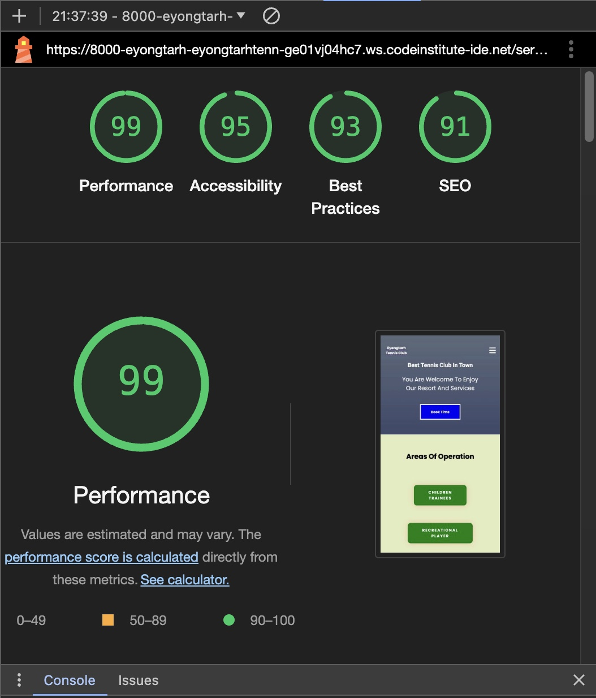
</a>

The accessibility rating for page 3 in lighthouse is OK. The lighthouse test for the book time page is shown below :

<a>
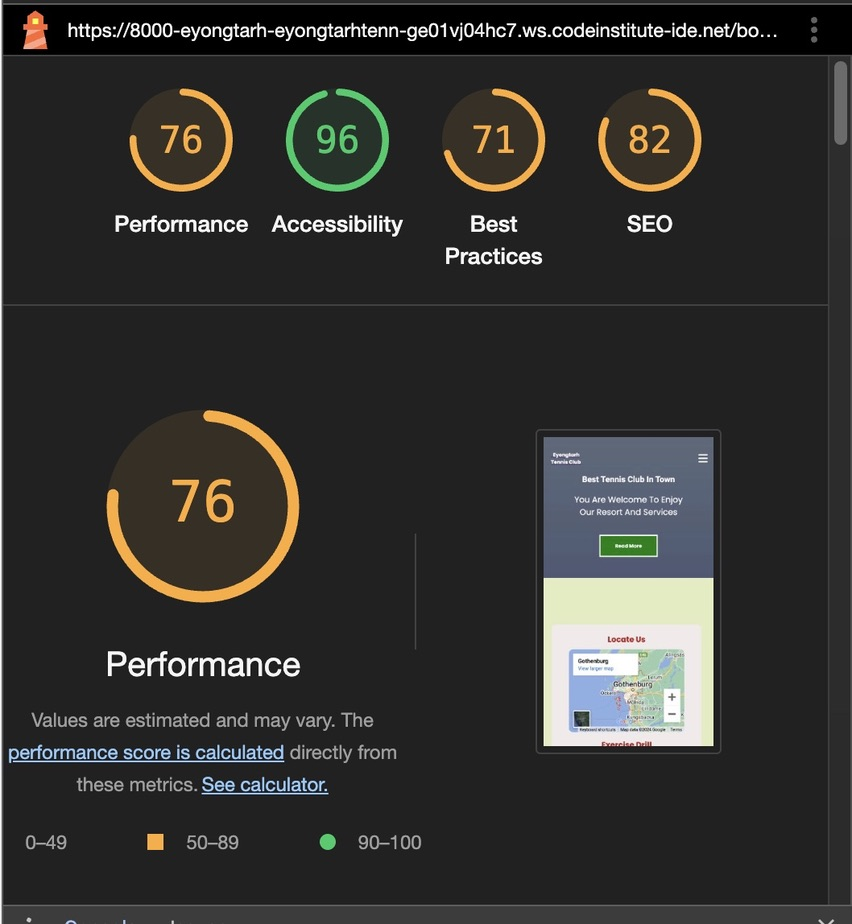
</a>

### Media Queries 

The site works on different screen sizes and therefore, it is fully responsive. The Responsive viewer was used to test for site responsiveness. A photo of page 1, page 2 and page 3 are shown below repectively.

<a>
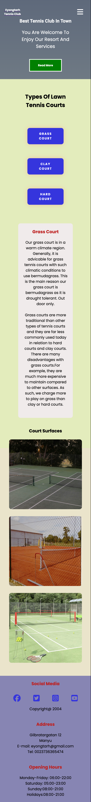
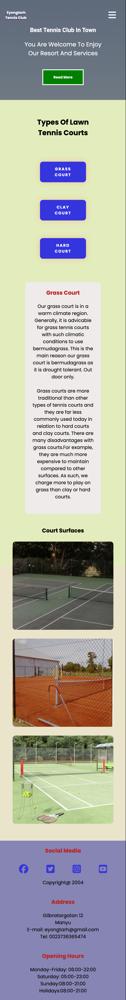
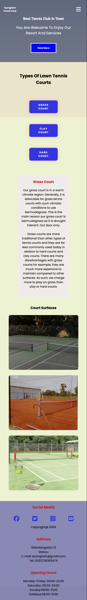
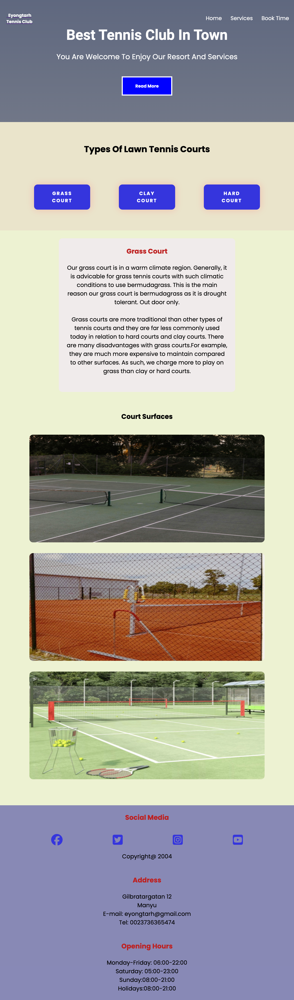
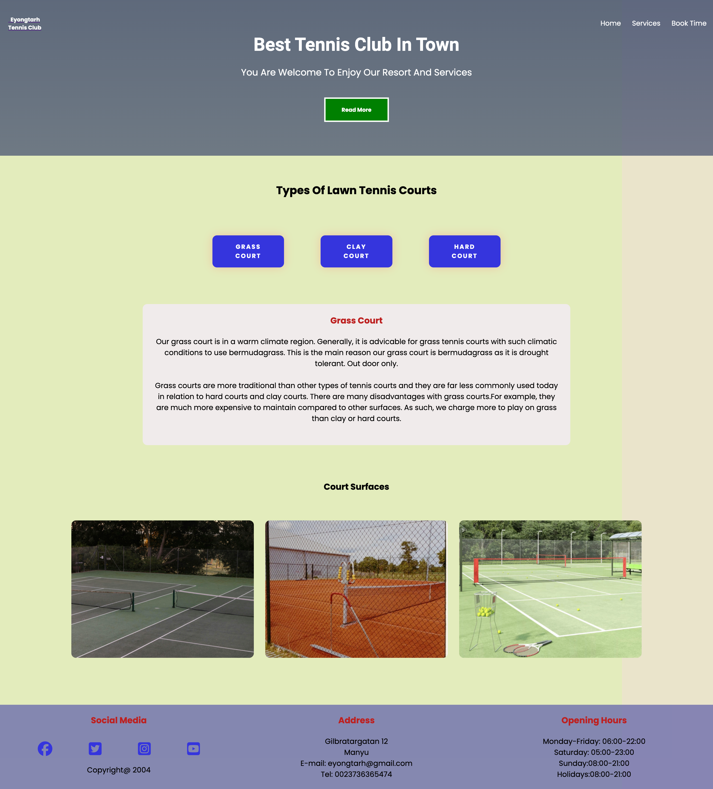
</a>

Check out <a href="https://responsiveviewer.org/" target="_blank">Site Responsiveness</a> by Responsive viewer.

### Validation Testing

-The HTML validator for the three pages returned no errors when passing through the official W3C validator. 
Page one:

<a>
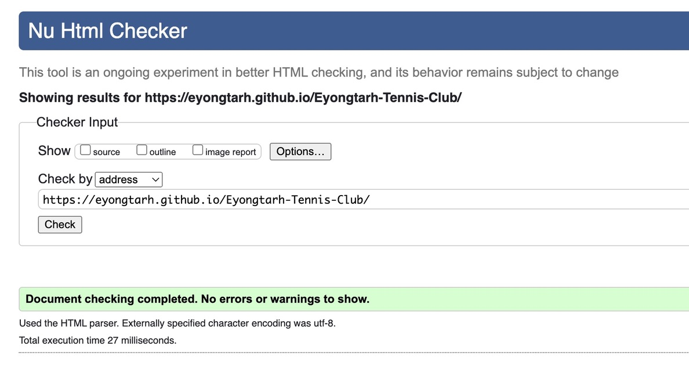
</a>

Page Two:

<a>
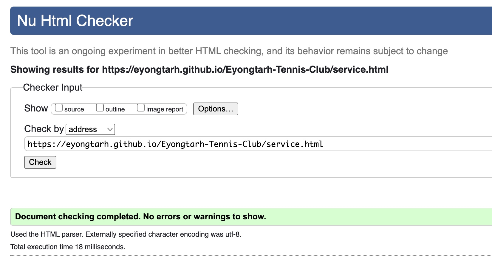
</a>

Page Three:

<a>
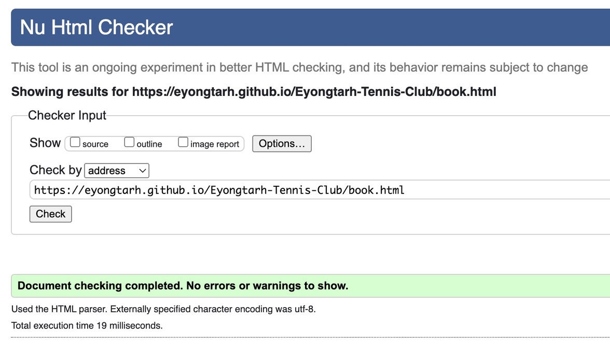
</a>

-The CSS validator shows no errors when passing through the official (Jigsaw) validator.
<a>
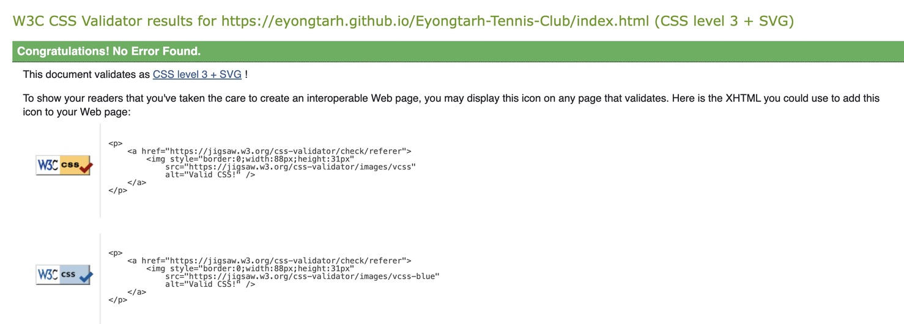
</a>

-The Js validator is also without errors.

### Bugs

#### Unfixed Bugs

I have not noticed any unfixed bug at the moment.

#### Fixed Bugs

- The welcome message in the header interfered with the logo in screen size with max-width of 768px. This was remedied by changing the value of transform translate along the y-axis from -50 to -40.

- The columns in the pages did not fit in smaller screen sizes. This was resolved by setting flex-direction of the divs to column.

- The video also overlaped in smaller screen sizes. The solution was to reduce the width and height of the video.

## Technologies Used
- HTML is used as the framework of the site
- CSS is applied for the styles and site layout
- Javacsript is used in webdevelopment, application and presentation.
- VSCode is the used for writing the and editing the codes.
- Git and Github used for version control and hosting website codes respectively.

## Deployment to GitHub Pages

This site is deployed to GitHub pages. Theprocedure is viz:
- Go to GitHub repository and click on Settings.
- At the left side, click on pages.
- At the source section drop-down menu, select the Main Branch
- At this point, click save, the page will be automatically refreshed.
- A link will be available and indicate the successful deployment.
- If not , refresh the page.

## Future improvements
- More content can be added.
- There is also a need to make appropriate comments within my code lines and commit statement.
- The form can be made to validate to a server in the long run.

## Credits

I got some help from the Love running project, course conten, Wikipedia , Kevin easy tutorials, Ullevi tennis club and geeksforgeeks.org website.

### Content 

I used font awesome and Google fonts.  

### Media
 - Background images, Favicon image, and images used within pages are from: [Pexels](https://www.pexels.com/).
 - I also used personal images and video.

#### Tools
 - [FreeConvert](https://www.freeconvert.com/video-compressor) was used to edit video.
 - [Compress JPEG](https://compressjpeg.com/) was used to compress JPEG images.
 - [IMGonline.com.ua](https://www.imgonline.com.ua/eng/resize-image.php) was used to resize images.
 - [FAVICON GENERATOR](https://favicon.io/) was used to generate the favicon.

## Acknowledgments

- [Code Institute](https://codeinstitute.net/) tutors and Mentor for their continues support.
- [Geeksforgeeks](https://www.geeksforgeeks.org/) tutorials to toggle menu bar.
