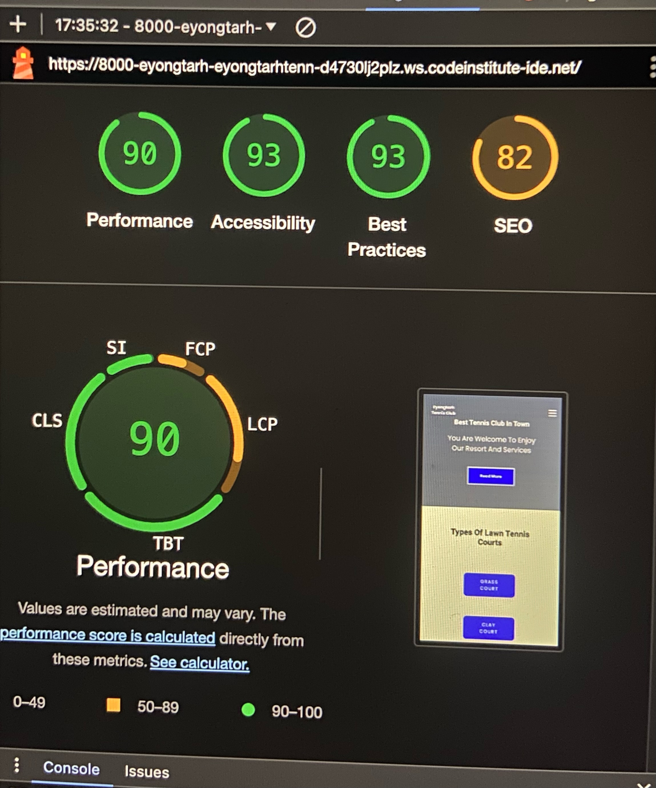
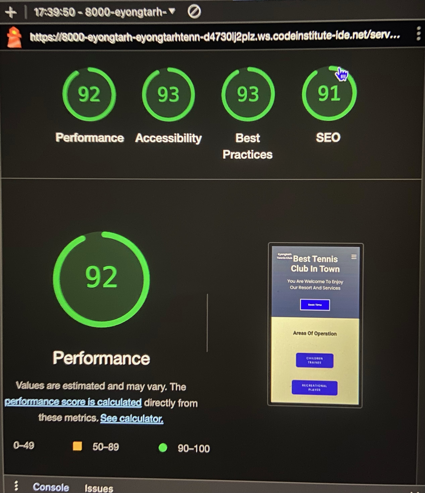
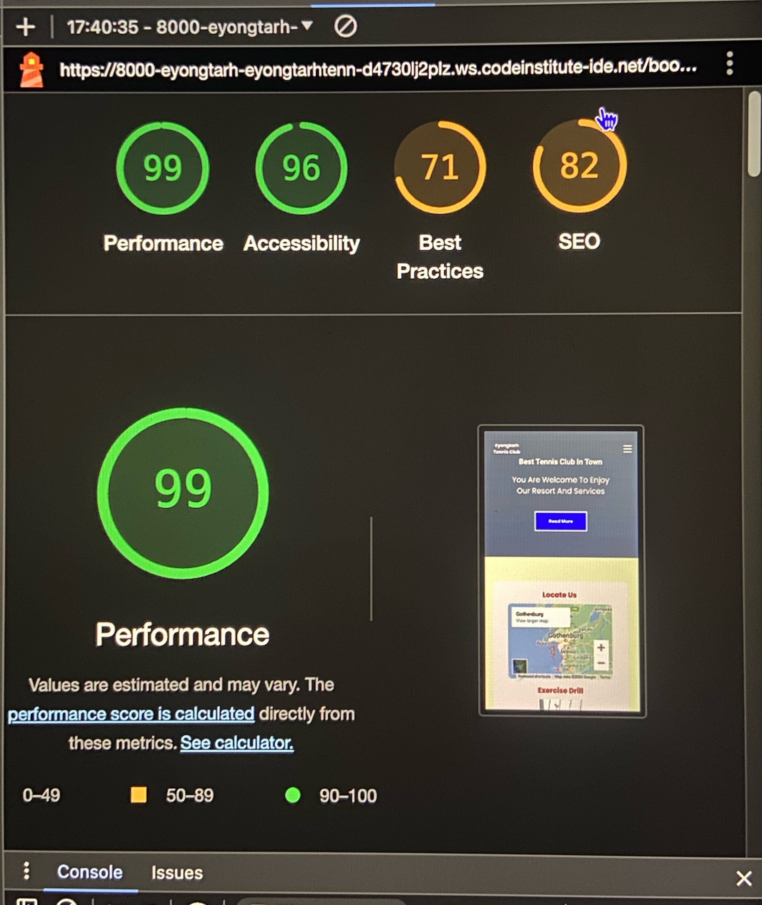
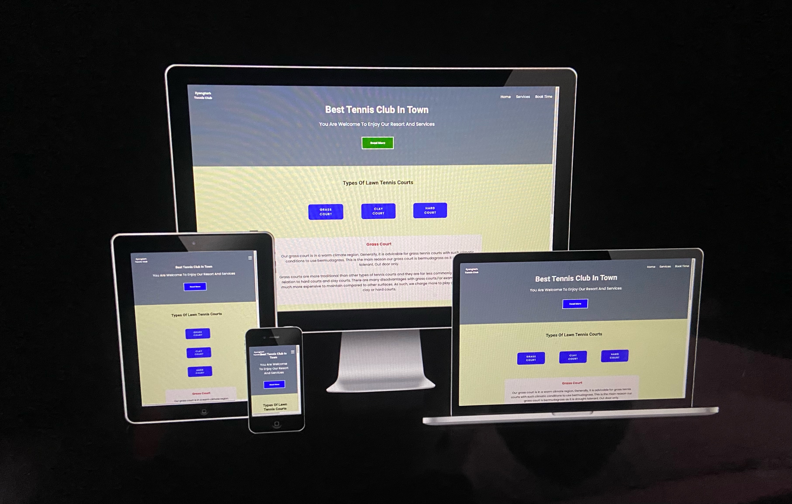

# Eyongtarh Tennis Club

[Link to Eyongtarh Tennis Club](https://eyongtarh.github.io/Eyongtarh-Tennis-Club/)

Eyongtarh Tennis Club is a club designed to help train children and adult lawn tennis skills from beginners to professional levels. The club also takes into consideration the fitness training of the trainees.

## Features

### Header

The header includes the name : Eyongtarh Tennis Club as logo. This logo has a link to the home page. The header also includes a navigation bar. The navigation bar accommodates the links to the three pages: Home, Services, and book time. The second part of the header incledes a welcome message for visitors or members to enjoy the club's resort and services.The last part is an anchor: "Read More" and this in linked to the service page, and in the service page, its linked to the book time page, and in the book time page, its linked to the service page. 

### Home 

Here, a note explaining the types of tennis courts available is displayed in three different columns.
It also highlights the nature of the courts and placement in relation to the surfaces which are clay court,
hard court and grass court. 
These three columns are displayed one at a time with a javascript code. The second part of home page is made of pictures of the three different courts. The names of the courts hover the pictures on moust over.

### Services

The services page is the second page. It indicates that the club is providing training to children, 
recreational players, and competitive players. Basically, the services are for children and adults. The three different training models are well explaine in this section. The second part of this page provides pictures of the different trainees. A text message of the trainee type hover each picture on mouse over.

### Bookin Time

This is the third and final page. The first column in section one contains a map location for Gothenburg town and a video example of tennis exercise drill. The second column provides a form which registers the customer and book time with a trainer. The second section is made up of pictures of other facilities in the club: play ground, swimming pool, and a gym/fitness. The names equally hover the pictures.

### Contact information
The address, email address and telephone number of the club is include in the footer section at the bottom of each page.

### The footer

The footer contains three different features in three columns. The first column is made up of links to social media websites which opens in a new page: Twitter, YouTube, Instagram, Facebook, and a copyrights statement. The second and third sections contains the contact information and opening hours respectively.

## Testing

### Within Page

The links included in the page works perfectly.The book time form also shows a positive respond to use. 

### Lighthouse

The accessibility rating in lighthouse is OK. The lighthouse test for the home page is shown below :

The accessibility rating in lighthouse is OK. The lighthouse test for the service page is shown below :

The accessibility rating in lighthouse is OK. The lighthouse test for the home page is shown below :

### Media Queries 

The site works on different screen sizes and therefore, it is fully responsive. The ui.dev/amiresponsive was used to test for site responsiveness. A photo and a link is presented below:

Check out <a href="https://ui.dev/amiresponsive?url=https://eyongtarh.github.io/Eyongtarh-Tennis-Club/" target="_blank">Site Responsiveness</a> by ui.dev/amiresponsive.

### Validation Testing

-The HTML validator returned no errors when passing through the official W3C validator. The link to input the values to be tested is below.

Check out <a href="https://validator.w3.org/detailed.html" target="_blank">HTML Validator</a>

-The CSS validator shows no errors when passing through the official (Jigsaw) validator.

-The Js validator is also without errors.

### Unfixed Bugs

I have not noticed any unfixed bug at the moment.

## Deployment

This site is deployed to GitHub pages. Theprocedure is viz:
-Go to GitHub repository and click on Settings.
-At the left side, click on pages.
-At the source section drop-down menu, select the Master Branch
-At this point, click save, the page will be automatically refreshed.
-A link will be available and indicate the successful deployment.
-If not , refresh the page.

## Credits

I got some help from the Love running project, course conten, Wikipedia , Kevin easy tutorials, Ullevi tennis club and geeksforgeeks.org website.

## Content

I used font awesome and Google fonts.

## Media

Favicon image, background images and images used within pages are from 
pixel, google, and my personal images/video.